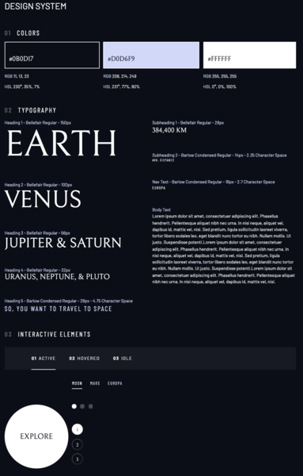
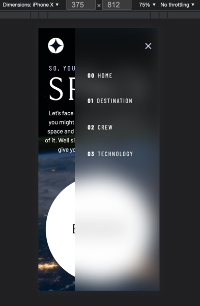
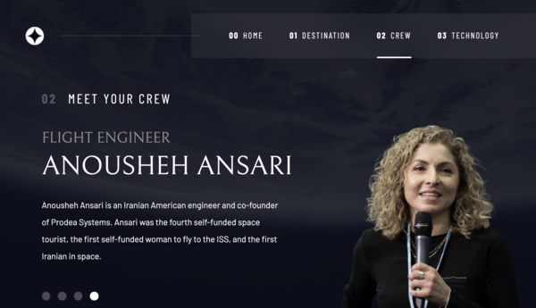
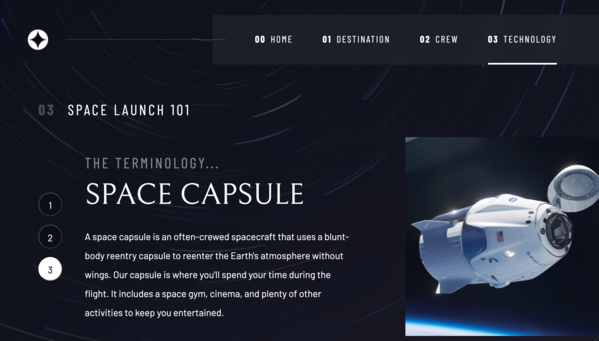

<h1># Space Tourism Website<h1>

<h2> A multipage website that advertises the next frontier of tourism: the space one! </h2>
  The website consists of a Landing Page (Home), and 3 other pages (1. Planets - where you can travel to; 2. Crew - people that drive the space expeditions; 3 Technology - brief expalanation of the cool stuffs that makes space tourism possible).
  Each of the 3 pages contains several subpages that use the same design layout. 
  
   

  
   

Working on this project was a challenging but fun exercise to develop and strengthen my pure CSS skills. Indeed it is the first project I did that focuses on fully <strong>responsiveness</strong> for different sizes devices and <strong>accessibility</strong> for people with physical disabilities, situational disabilities, and socio-economic restrictions on bandwidth and speed.

Moreover, working on this project I tryed to follow and apply all the good practices for an efficient stylying system. 

 
  <h2>The Design System</h2>
Everything started crafating the design system for Fonts, Colors, Elements, Buttons etc... The final results is the picture below:
 

 
  
  <h2>Default settings, Utility Classes and Custom Properties</h2>
While creating the design system, I defined the basic rules for the UI of the websites pages --> 1. Reset of sensible default settings; 2. Create Utility Classes; 3 Define Custom Properties. Afwerwards, the main part of the job consisted on creating the layout for the different pages. On this matter, the novelty, for me, consisted on defining the design for mobile first, and then, through the use of @media queries, tailored the layout for tablets and desktops as well. 
 
  
  <h2>JavaScript</h2>
  
The needs to use JavaScript was limited to 
  1.enable the navigation bar to open and collapse at the users'need (N.B. case specific for mobile devices)
   
  
  
  
   
  2.allow users to use keytabs to navigate on the website;
   
 
  <h2>Conclusions and Learnings</h2>
  This project inspired by FrontEnd Mentor [a relative link]https://www.frontendmentor.io gave the opportunity to sharpen my CSS skills, to work on a responsive website, to realize the importance of accesibility, and probably, above all, the need to define classes for 99%, if not all, of the HTML elements that we write. 
  
   
  
  <h3>More screenshots of the website<h3>
   

   

   
  

